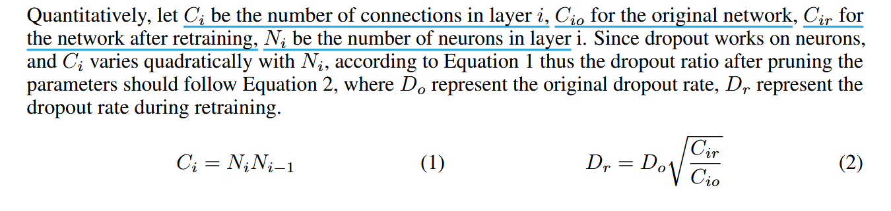
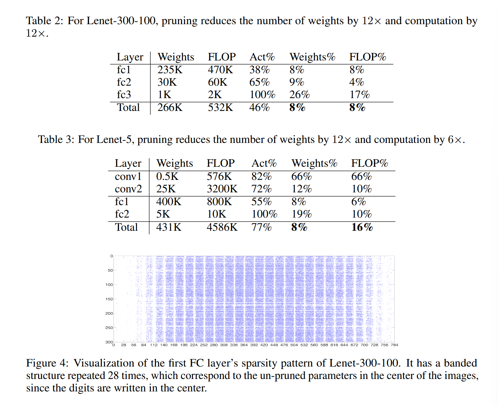

# Learning both Weights and Connections for Efficient Neural Network

(NIPS 2015 , 8785 citation on Google Scholar by 2025/04/25)

## Background

神经网络即是计算密集型，也是内存密集型，使其很难在嵌入式系统上部署，希望能在不影响精度的前提下减少内存与计算开销。

为解决该问题，考虑通过学习网络中重要连接，将不重要连接删掉以减少冗余。使用三步方法修剪冗余连接，先训练网络以确定重要连接，再删除不重要连接，最后重新训练网络微调剩余连接权重。

## Method

prune connections 通过删去低于阈值的权重，来将密集网络变为稀疏网络。

接着介绍不同组件对 prune 影响

### Regularization

- 如果不进行 retrain ，L1-regularization 效果更好（因为 L1-regularization 惩罚非零参数使得更多参数接近 0）

- 如果进行 retrain ，L2-regularization 效果更好

- 且整体上，L2-regularization 效果更好

### Dropout Ratio Adjustment 

Dropout 用于阻止 over-fitting，由于剪枝已经降低了模型容量，所以 retraining dropout ratio should be smaller。 

### Local Pruning and Parameter Co-adaptation

- 在 retraining 时，最好加载 initial training 时权重而不是重新初始化

- 由于神经网络易受梯度消失问题（此时 resnet 还未问世 qwq），采用交替冻结，分步重训练，即 retrain FC 时冻结 conv ，剪枝完 FC 后，再冻结 FC 剪枝 conv 

### Iterative Pruning

- 与单步剪枝相比，重复剪枝可在不损失精确度前提下，将剪枝率从 5 倍提高到 9 倍在 AlexNet 上。

- 每次迭代使用 greedy search 能找到最好的连接，尝试过基于参数绝对值的概率性剪枝方法，但这样做效果差

### Pruning Neurons

- 剪掉部分连接后，若某个神经元的输入连接全为 0 或输出连接全为 0，那这个神经元可以被安全地删除，因此剪枝可进一步扩展为: 把与被减除神经元相连地所有连接也一并删除

- retraining 中会通过梯度下降和正则化自动清理无效神经元，因为若一个神经元若无输入或输出连接，在前向传播时不会对最终损失函数产生任何影响，所以在反传时梯度为 0，此时只有正则化项会调整这些权重从而将其压缩为 0 .

## Experiment

使用 Caffe，在 Lenet-300-100, Lenet-5 on MNIST, AlexNet and VGG-16 on ImageNet 上进行实验

### LeNet on MNIST

剪枝 retrain 时采用原始学习率的 1/10

### AlexNet on ImageNet

### VGG-16 on ImageNet

## Discussion

## Conclusion
