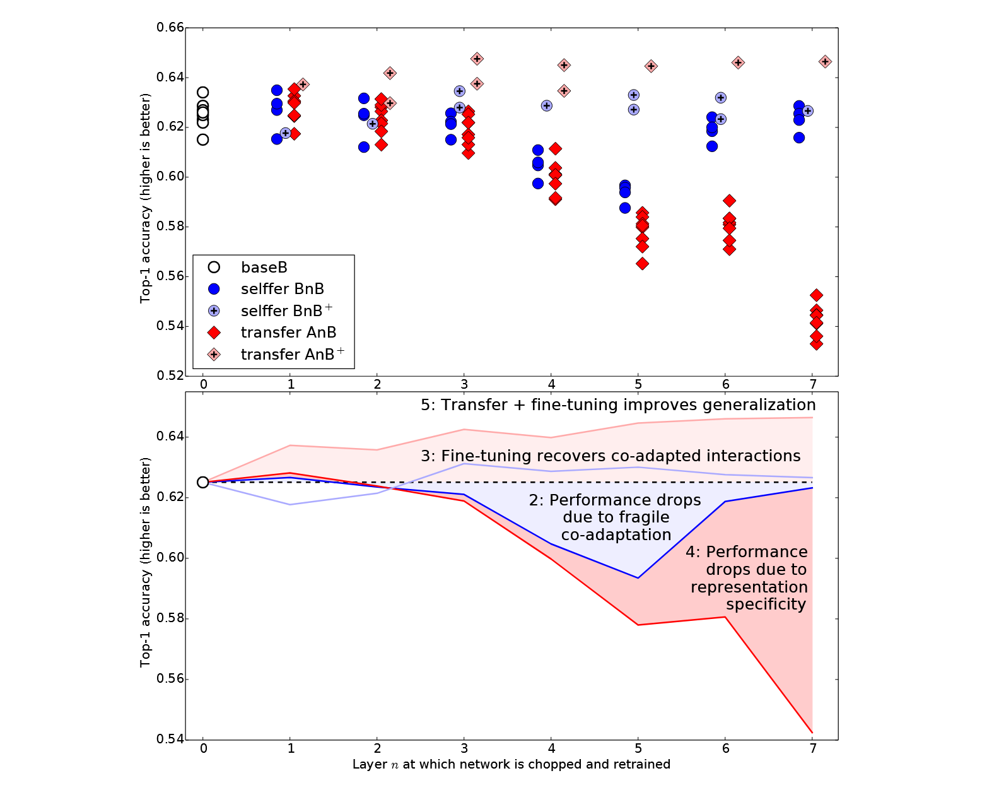
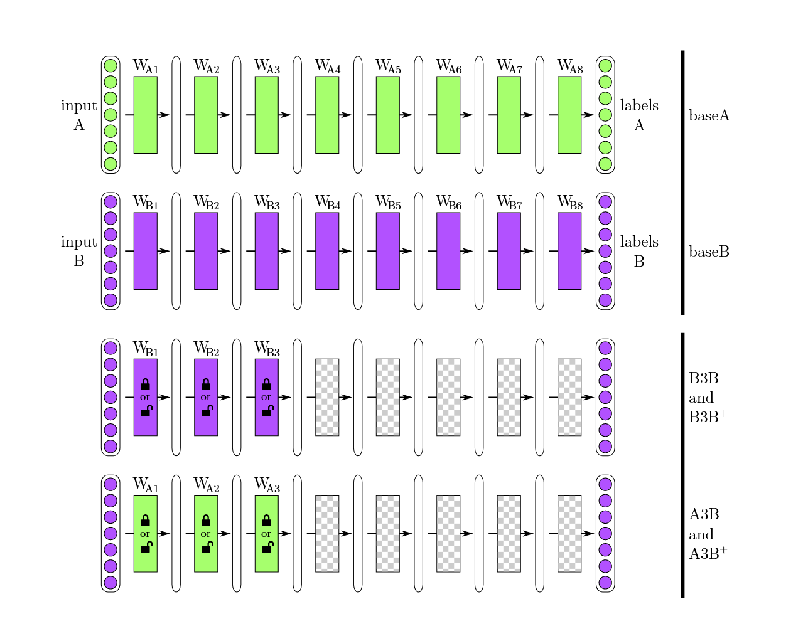
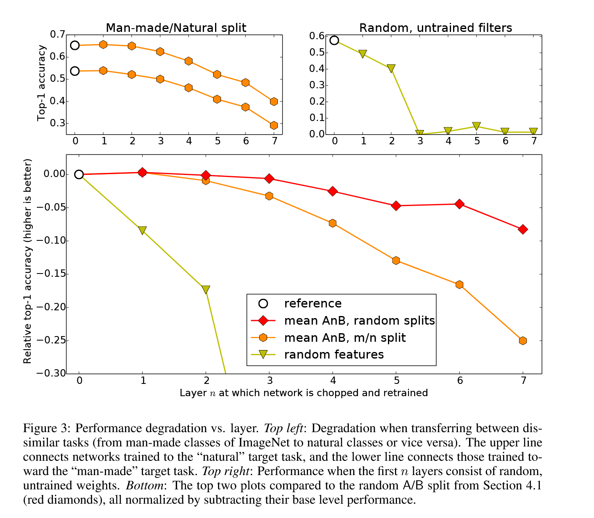

# How transferable are features in deep neural networks ?

## Induction

**deep neural networks' curious pheomenon based on CNN** : 在 image 上训练时，第一层学习到的特征通常类似于 Gabor filters 或 clor blobs，且在不同 datasets，不同 training objectives 上都会出现

> Gabor filters : 一种特殊的图像滤波器，主要用于捕获图像中的纹理和边缘信息，能在不同的空间频率和方向上对图像进行分析。
>
> Color blobs（颜色斑块）: 基本的颜色信息 

### What is the main problem of the research ?

- Can we quantify the degree to which a particular layer is general or specific ?

  - 对量化存疑，实验通过对比来比较
    
- Does the transition (general --> specific) occur suddenly at a single layer, or is it spread out over several layers ?

  - 渐进式

- Where does thie transition take place : near first, middle, or last layer of the network ?

  - 中间，严格来说是一个渐变的过程

## Expermiental and Analysis

### Preparation and Basic setup

**Define 'generality'** : 在 task A 上学习到的特征所能扩展到 task B 上的程度，该定义依赖于 task A 和 task B 的相似性

**Basic setup** : 

- similar tasks vs. dissimimilar tasks (base on  ImageNet-1k)

- selffer network vs transfer network  (every layer)

- fronzen transfer layer vs learned transfer layer

### Similar Analysis

- base B top-1 error rate 37.5% 低于 1000-class network 42.5% (推测是过拟合) 

- 对 BnB 性能下降表明原始网络各层间包含脆弱的 co-adapted features，且 co-adapted features 不能单独由上层学习出来，但可通过 fine-tune 上层来解决这一问题

- 基于 BnB 的对照，AnB 性能下降出来特征越来越不 general ，还有 lost co-adaption，且不同层 transfer 支配情况不同

- 在相似任务迁移时，迁移特征并允许微调会增强在新任务上的泛化能力，且由与 BnB+ 的对比知并不是由于训练时间变长造成的，推测是由于避免了过拟合  

### Dissimilar Analysis

**dataset setup** : 基于 ImageNet 提供的父类层级，将图片分为 man-made entities 和 natural entities，略微有些不均匀，man-made group 551 classes，natural group 449 classes

**hypothesis** : base task and target task 越不相似，特征迁移有效性越差

### Random Weights

**Jarrett et al.(2009)** : 及时卷积层的滤波器是随机生成的（未经学习），再经过 ReLU 激活，池化和局部归一化后，这些随机特征提取器的效果能接近经过训练学习出来的特征。

**Question** : 上述结论是在两层神经网络基于 Caltech-101 dataset 上得到的，是否随机滤波器能在更大数据集更深神经网络上得到相同效果？

**conclusion** : 

- 随着层数 n 增加，冻结特征时的迁移性能差距会迅速扩大

- 即便是从一个 “差距较大” 的任务迁移特征，也优于随机生成的滤波器
 

